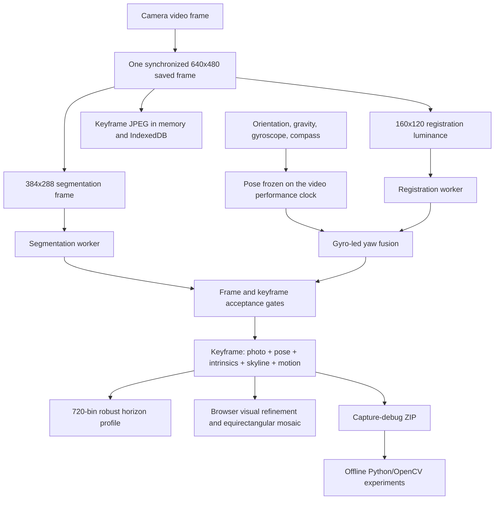

# Horizon Scanner engineering handoff

Status date: 2026-08-16  
Repository: `C:\Users\Owner\Documents\GitHub\AdamMacInfo\Horizon-Scanner`  
Branch at handoff: `main`  
Baseline commit: `189eddc`  
Working state: the changes described here are present locally and are not yet committed.

## 1. Executive summary

Horizon Scanner is a static, browser-only field application for measuring a
360-degree obstruction/horizon profile and building an azimuth/elevation-aware
panorama from the same captured evidence. Its intended field device is currently
an iPad, although the sensor and camera code is written to tolerate several
browser implementations.

The application has two related products:

1. A 720-bin horizon profile, one altitude value every 0.5 degrees of azimuth,
   suitable for OnStep telescope-controller limits.
2. A diagnostic panorama whose internal consistency is important because the
   operator can compare or manually trace the horizon against the imagery.

The current priority is panorama reconstruction. The browser still computes the
profile, but the source photographs, camera poses, lens geometry, and debug
evidence are now treated as first-class output so that a more sophisticated
offline stitcher can be developed and then ported back to JavaScript.

The important current conclusion is that the saved sensor data is useful:

- saved elevation predicts measured vertical image movement extremely well;
- cross-lap photographs contain hundreds of strong visual matches;
- the main failures in the 61-frame field capture were a 90-degree image/pose
  rotation mismatch, repeated missing photo sectors, a slightly uncertain field
  of view, and local parallax around a nearby house;
- a global spherical or rotation-only stitch can improve the result, but a
  perfect nearby roof ultimately requires local mesh/APAP warping and careful
  seam/source selection.

## 2. Source-of-truth warning

The root `README.md` contains a long chronological field-fix log. It is valuable
history, but some older status statements are no longer current. In particular,
its statement that rotation-only bundle adjustment is “not yet wired into the
mosaic build” is obsolete: it is now invoked by `buildPanorama()` through
`js/panorama-optimize.js`.

For the current system state, use this document plus the code. Treat older field
log entries as historical explanations rather than a current specification.

## 3. System architecture

The app has no build system and no package manifest. `index.html` loads native
ES modules directly. Camera and motion sensors require a secure browser context;
`localhost` is sufficient for development and HTTPS is required on a separate
phone or tablet.



### Main modules

| File | Responsibility |
|---|---|
| `index.html` | Single-page UI, controls, canvases, reports, and export buttons. |
| `js/main.js` | Application orchestration, capture loop, state transitions, keyframe admission, panorama build, storage and export wiring. |
| `js/camera.js` | Camera selection, stream normalization, rotation, synchronized frame generation, crop geometry, lens state, and JPEG encoding. |
| `js/orientation.js` | Device-orientation quaternion, gravity, raw gyroscope integration, bias/axis/scale diagnostics, compass auditing, and motion history. |
| `js/pipeline.js` | Single-flight worker orchestration and dropped-frame/backpressure accounting. |
| `workers/segment.worker.js` | Classical multi-cue sky/ground segmentation and per-column skyline boundary. |
| `workers/vision.worker.js` | Coarse-to-fine normalized-correlation registration between sequential frames and loop closure. |
| `js/survey.js` | Keyframes, projection into 720 bins, robust aggregation, weak sectors, loop correction, focal estimation, report and grade. |
| `js/guide.js` | Capture state machine and human-readable instructions. |
| `js/capture-policy.js` | Keyframe spacing and motion thresholds. |
| `js/capture-gaps.js` | Photo-to-photo overlap measurement and exact recapture bearings. |
| `js/bundle.js` | Below-skyline features, matching, pair verification, and gravity-constrained rotation-only bundle adjustment. |
| `js/panorama-optimize.js` | Safe browser wrapper around `bundle.js`, including graph limits, progress, and sanity gates. |
| `js/panorama.js` | Equirectangular reprojection, mosaic generation, skyline tracks, disagreement and drawing. |
| `js/diagnostic-export.js` | Source-photo/debug ZIP construction and offline stitch manifest. |
| `js/exporters.js` | HZN1, HZN2 and `.horizon-project` formats. |
| `js/storage.js` | IndexedDB sessions and keyframe-photo blobs. |
| `tools/stitch_debug_bundle.py` | Separate Python/OpenCV proof stitcher. |

## 4. Operator workflow and state machine

The state machine is `idle -> calibrating -> pass1 -> analysing -> pass2 ->
validating -> complete`.

### 4.1 Start and calibration

1. The app requests camera and motion/orientation access.
2. A stationary measurement estimates gyro bias and checks whether the device
   was actually still.
3. The operator waves/tumbles the device. The solver identifies browser gyro
   axis order, signs, handedness, and a conservative scale using gravity motion.
   It refuses ambiguous evidence rather than installing a guess.
4. Unless the operator explicitly supplied a manual lens value, a guided lens
   measurement follows. Horizontal focal length is measured from pixel motion
   against gyro yaw; vertical focal length is independently measured from pixel
   motion against gravity-derived elevation change.
5. A known iPad lens entry is only a seed/prior. It no longer skips the guided
   measurement. A successful field measurement replaces the prior and survives
   harmless stream reorientation.
6. The upright settle stage establishes the relative yaw datum. The compass may
   supply a slow absolute datum, but it does not drive relative panorama shape.

### 4.2 First lap

The guide requests a counter-clockwise sweep. The current dense keyframe spacing
is 20% of horizontal FOV, with a minimum of 3 degrees. For a 45.6-degree working
FOV this is about 9.1 degrees between photographs, or roughly 80% horizontal
overlap.

Keyframes are rejected when:

- segmentation failed;
- there is no synchronized camera packet;
- the frame is too high, parallax-marked, tracking-lost, too dark, no-sky,
  all-sky, or heavily clipped at the top;
- instantaneous yaw motion exceeds 35 degrees/s handheld, 20 degrees/s tripod,
  or 3 degrees/s during a high-obstruction probe;
- the required angular spacing has not yet been reached;
- targeted cleanup is not centered/still long enough.

Roll is not a keyframe rejection gate. The full quaternion carries roll through
projection, and rejecting it previously blocked a valid iPad capture whose
screen rotation had been misreported.

At the end of pass 1, the app:

- visually matches the current view to the starting view when possible;
- checks whether total rotation has a gross scale error;
- distributes residual loop-closure yaw across the keyframe chain;
- reprojects every stored skyline from image coordinates;
- measures photo-overlap gaps and logs exact recapture bearings;
- starts pass 2.

### 4.3 Verification lap and cleanup

A normally completed first lap has no two-pass-verified bins, so pass 2 is a
second dense counter-clockwise lap, not one static target hold.

When the operator finishes the verification lap, the app no longer immediately
ends the survey. It switches to targeted cleanup if either of these remain:

- profile sectors that are still weak/unverified;
- chronological source-photo gaps whose overlap is below 35%.

Photo gaps are converted into one or more exact intermediate bearings. For
example, a 60-degree gap with a 35-degree FOV needs two additional photographs,
not merely one at the midpoint. The guide sends the operator to each calculated
bearing and classifies those frames as `targeted-cleanup`. Once those frames
bridge the original pair, the targets disappear.

### 4.4 High-obstruction probe

The probe keeps yaw fixed while the camera is tilted upward to capture a high
roof or obstruction. It requires roughly 20–70 degrees elevation, high
stillness, and low motion. Visual translation while the gyro says the device is
still is treated as evidence that the optical center moved and local parallax
was introduced.

## 5. Runtime image and sensor pipeline

### 5.1 One exposure, three representations

`CameraSource.grabSynchronizedFrame()` draws the live video exactly once into a
640x480 screen-aligned keyframe canvas. The segmentation image and registration
luminance are derived from that canvas, so the stored photograph, skyline and
pose do not accidentally describe three different video moments.

- saved keyframe image: 640x480 JPEG, normally encoded at quality 0.72;
- segmentation working image: 384x288 RGBA;
- registration image: 160x120 luminance.

These are panorama source keyframes, not original full-resolution/raw camera
files. They are exactly the pixels used by the browser panorama and are the
correct debugging unit, but a future high-resolution product may need a second
full-resolution still-image capture path with carefully synchronized timing.

### 5.2 iPad rotation correction

The failed 61-frame capture showed every saved JPEG rotated 90 degrees clockwise
relative to its pose. iPadOS had retained a stale `screen.orientation.angle=90`
while the actual viewport and decoded video were portrait.

The current camera code re-detects rotation immediately before every draw. When
viewport dimensions are known, the viewport aspect is treated as the physical
truth and overrides the stale screen-angle report. Automatic detection currently
chooses 0 or 90 degrees; manual 0/90/180/270 override remains available for
platforms with a different convention.

### 5.3 Exact crop/cover transform

Each exposure now records the complete cover-fit transform used to make the
saved 640x480 image:

- decoded source width and height;
- rotation and whether axes were swapped;
- screen-aligned source dimensions;
- output dimensions;
- scale and drawn dimensions;
- exact visible rectangle in screen-aligned source pixels;
- retained width and height fractions.

It also records viewport dimensions/device pixel ratio and the live media-track
settings the browser exposes, including frame rate, exposure mode/time, ISO,
focus mode/distance, white balance, color temperature and zoom.

### 5.4 Sensor policy

- Gravity/accelerometer determines vertical and is the strongest elevation
  prior.
- The raw gyroscope is integrated for relative azimuth. It leads the fused yaw
  because its scale is metric after calibration and it does not contain magnetic
  heading swings.
- Sequential visual registration checks the gyroscope, determines pixel/yaw
  sign, helps measure the lens and can veto an opposed confident motion. It is
  not blended into gyro yaw when the gyro is trustworthy.
- The compass supplies only a slowly sampled datum and is demoted when its motion
  disagrees with visual/inertial rotation.
- Above 65 degrees elevation, horizontal image translation is not trusted as
  yaw. Above 78 degrees, normal capture is rejected because yaw becomes unstable
  near the zenith.

At exposure time, all pose fields are frozen before awaiting workers. This
prevents a later orientation event from being attached to an earlier video
frame.

### 5.5 Motion history

Each keyframe carries the instantaneous gyro snapshot plus a copied motion-history
window requested around the video performance timestamp. The history retains raw
device rates, remapped rates, gravity, world-up in device coordinates, integrated
yaw, and orientation quaternion.

The query is nominally ±350 ms, but live capture calls it immediately. Therefore
the exported window normally contains samples already received—mostly before or
at exposure—not a guaranteed delayed, symmetric post-exposure window. A future
offline-calibration upgrade should finalize the window 350 ms later or export a
continuous session IMU stream.

## 6. Keyframe data model

Every accepted keyframe contains:

- identity: index, timestamp, pass and capture kind;
- per-frame intrinsics: `tanHalfH`, `tanHalfV`, focal pixels;
- raw screen-aligned orientation quaternion;
- raw yaw, fused yaw, yaw-base correction and later loop correction;
- center elevation, roll and compass heading;
- synchronized saved-photo dimensions and capture timing;
- frozen device-orientation sample;
- gyro snapshot and motion window;
- visual match quality and sky fraction;
- 384-column skyline boundary, confidence and flags.

Intrinsics are stamped per frame. If the phone swaps physical lenses mid-survey,
old frames remain projected through the optics they actually used.

Capture kinds currently are:

- `sweep`: chronological pass-1/pass-2 frame;
- `targeted-cleanup`: later photo or profile-gap repair;
- `obstruction-probe`: elevated view held at a fixed yaw.

## 7. Profile reconstruction and acceptance

The profile contains 720 circular bins at 0.5-degree spacing.

For each valid skyline column, the app:

1. converts column/pixel row into a camera ray using that keyframe's intrinsics;
2. rotates the ray into the ENU world frame with the keyframe quaternion and yaw
   corrections;
3. converts the ray to azimuth/altitude;
4. places it in the nearest 0.5-degree bin;
5. down-weights outer image columns where distortion and focal uncertainty are
   greatest.

Per-bin altitude is a weighted median with a robust MAD outlier pass. Acceptance
requires at least four observations, at least two passes, mean confidence of
0.42, and spread below 1.5 degrees plus a local-slope allowance. The slope
allowance prevents a real near-vertical roof edge from being mislabeled as
noise. Isolated deviations greater than 5 degrees from a local median are
demoted as spikes.

The standard HZN exports are gated by the report unless the operator explicitly
forces an unverified export.

## 8. Browser panorama pipeline

### 8.1 Source loading

Every accepted keyframe attempts to encode and retain a JPEG regardless of the
“embed images in project archive” checkbox. The checkbox controls only the
normal `.horizon-project` size.

Photos are held in both:

- an in-memory map for the current session;
- IndexedDB for reload/session persistence.

The explicit budget is 600 frames or 40 MB. IndexedDB failure is logged and the
in-memory copy continues to support the current session.

### 8.2 Visual rotation refinement

When “Use keyframe photos” is enabled and at least two images are available,
`buildPanorama()` now calls `optimisePanoramaRotations()` before mosaicking.

The optimizer:

1. seeds every camera from its sensor quaternion, yaw datum and loop correction;
2. extracts up to about 160 corner-like features per image only below that
   frame's skyline, excluding moving cloud;
3. predicts overlapping pairs from sensor poses and caps graph degree at six;
4. searches within 40 pixels of the sensor-predicted location;
5. uses normalized patch correlation, a uniqueness ratio and subpixel peak fit;
6. fits each pair to one relative rotation and repeatedly tightens its outlier
   threshold;
7. runs robust rotation-only bundle adjustment.

Gravity is protected by a 50.0 tilt prior versus a 0.5 yaw prior. The result is
discarded unless it has at least 20 solver matches, moves no frame more than 12
degrees in total, and moves tilt no more than 1 degree. Diagnostics are shown in
the panorama findings and exported.

This refinement currently affects the panorama build and its diagnostic skyline
tracks. It does not rewrite the survey's 720 profile bins or automatically alter
HZN output. The refined per-frame quaternions are copied into debug metadata so
they can be inspected offline.

### 8.3 Mosaic renderer

`buildMosaic()` produces an equirectangular azimuth/altitude panel. Each output
pixel is taken from the source frame that sees it closest to its optical axis.
There is intentionally no image blending in the current browser renderer.

That design makes geometry errors visible as hard seams instead of hiding them
inside a smooth blend. It is useful diagnostically, but it is not yet the final
high-quality panorama compositing strategy.

### 8.4 What it still cannot solve

A rotation-only model assumes every view came from one fixed optical center and
all scene structure lies on rays at infinity. A nearby house violates that
assumption when the operator shifts position or pivots around a point other than
the camera. Roof, siding, trees and background then demand different local
warps.

The production-quality next stage needs:

- sensor-constrained local mesh/APAP warping;
- depth/parallax-aware seam selection;
- choosing one lap/source near close-object boundaries instead of averaging
  translated views;
- multiband blending only after geometry is locally consistent;
- final mapping back to the saved absolute azimuth axis.

## 9. Capture-gap detection

`captureGapReport()` groups chronological `sweep` frames by pass and compares
each adjacent accepted pair.

For mean horizontal FOV `F` and center-axis step `S`, estimated overlap is:

```text
overlap = clamp(1 - S / F, 0, 1)
```

Pairs below 35% are gaps. The desired maximum step is `F * (1 - 0.35)`. The
module computes how many intermediate segments are needed and produces their
exact wrapped bearings plus compass labels. Existing frames from another pass or
targeted cleanup can satisfy those recommended positions within 3 degrees.

The report includes pass-level frame count, signed travel, median/p90/max step,
every unresolved pair, true uncovered angular width, and required recapture
bearings.

Current limitation: the implementation checks adjacent chronological frames
inside each pass but does not add a separate last-frame-to-first-frame closure
pair. Loop closure, bin coverage and the visual graph still expose many closure
failures, but explicit photo-gap closure checking is a worthwhile follow-up.

## 10. Capture-decision audit

The app now counts every keyframe decision reason and stores a rate-limited
event trail with timestamp, phase, pass, heading, fused yaw, elevation, roll,
yaw rate, stillness, frame status and overlap.

Reasons include:

- `accepted`;
- `segmentation-error`;
- `no-synchronized-frame`;
- `frame-tooHigh`, `frame-parallax`, `frame-trackingLost`, `frame-tooDark`,
  `frame-noSky`, `frame-allSky`, `frame-clippedTop`;
- `motion-too-fast`;
- `spacing-not-reached`;
- `probe-not-still-or-elevation`;
- `off-target-or-not-still`.

Counts are exhaustive for processed frames. Events are sampled when the reason
changes, after one second of repetition, or on every accepted keyframe, and are
capped at 2,500 records.

This closes a major evidence gap in the 61-frame analysis: the repeated missing
sector could only be inferred to have been blocked by segmentation because the
old ZIP did not say why candidate frames were rejected.

## 11. Export formats

### 11.1 Controller/profile outputs

- `.hzn`: legacy HZN1 controller payload; cannot encode missing bins, so export
  is gated.
- `.hzn2`: extended payload with per-bin quality/status and CRC.
- `.horizon-project`: recomputable JSON containing site metadata, profile,
  keyframes, intrinsics, sensor health and report; keyframe images are optional.
- panorama PNG: rendered browser panorama only.

### 11.2 Capture-debug ZIP

The “Download source photos + debug ZIP” button waits for pending JPEG encodes
and builds one archive. Current session format is `horizon-capture-debug`,
version 2.

```text
README.txt
photos/
  keyframe-0000.jpg
  keyframe-0001.jpg
  ...
metadata/
  session.json
  keyframes.json
  keyframes.csv
  stitch-manifest.json
  capture-gaps.json
  capture-audit.json
  panorama-optimization.json
  project.horizon-project
logs/
  field-log.txt
  debug-bundle.txt
```

#### `metadata/session.json`

Contains format/version, export time, session/site data, normal capture metadata,
acceptance report, photo/keyframe counts, missing photo indexes, gap count, audit
summary, panorama-optimization summary and final application snapshot.

#### `metadata/keyframes.json`

This is the full forensic record. Each entry ties one photo to:

- capture and stitched/output bearings;
- center altitude, roll and compass;
- raw, placed and visually refined quaternions;
- screen angle and all yaw corrections;
- complete gyro snapshot/motion window;
- per-frame intrinsics;
- exact synchronized capture/crop/track settings;
- the skyline boundary/confidence/flags;
- directly projected azimuth and altitude for every skyline column.

`placedQuaternion` is the sensor pose with datum and loop yaw applied.
`visuallyRefinedQuaternion` is present only when the browser optimizer produced
and used a sane solution.

#### `metadata/keyframes.csv`

A flattened per-photo table for quick inspection in a spreadsheet. The JSON is
authoritative for nested arrays and complete camera geometry.

#### `metadata/stitch-manifest.json`

This is the compact entry point intended for the next-generation offline
stitcher. It declares the coordinate convention and contains, per image:

- path, timestamp and dimensions;
- raw and placed quaternions;
- optional visually refined quaternion;
- horizontal/vertical half-angle tangents;
- center azimuth/altitude/roll;
- exact cover-fit transform and track settings.

The existing Python proof script predates this manifest and still reads
`keyframes.json`; the manifest is deliberately redundant for backward
compatibility.

#### `metadata/capture-gaps.json`

Machine-readable overlap/gap measurements and recommended recapture bearings.

#### `metadata/capture-audit.json`

Full decision counts and the sampled rejection/acceptance event timeline.

#### `metadata/panorama-optimization.json`

Records whether visual refinement was applied, why it may have been skipped,
source/candidate/verified pair counts, raw and verified matches, solver RMS,
matched-frame count, maximum yaw/tilt/total movement and per-frame movement.

#### Logs and project

The archive also carries the normal recomputable project, raw field log and a
human-readable debug bundle with state snapshot, lens inventory and acceptance
report. Missing photos are declared; they are never fabricated.

## 12. Offline Python stitcher

The offline proof is intentionally separate from the browser code:

- script: `tools/stitch_debug_bundle.py`;
- dependencies: `tools/requirements-stitch.txt`;
- usage notes: `tools/README-stitcher.md`.

### Setup

```powershell
py -m venv .venv-stitch
& .\.venv-stitch\Scripts\python.exe -m pip install -r tools\requirements-stitch.txt
```

### Run

```powershell
& .\.venv-stitch\Scripts\python.exe tools\stitch_debug_bundle.py `
  "C:\Users\Owner\Downloads\home-back-yard-capture-debug-2026-08-15-23-10-55.zip" `
  --output stitch-output
```

Useful options include `--anchor-index`, `--anchor-azimuth`,
`--pano-confidence`, `--pixels-per-degree`, `--alt-min`, `--alt-max`, and
`--no-sensor-preview`.

### What the script does

1. Reads `metadata/keyframes.json` and decodes referenced photos with path
   traversal protection.
2. Sorts frames by timestamp and chooses a midpoint/default panorama cut.
3. Detects SIFT features below each saved skyline.
4. Computes adjacent ratio matches, RANSAC homography inliers and reprojection
   errors for diagnostics.
5. Builds a sensor-only equirectangular panorama from saved quaternions and
   intrinsics; this retains the app's azimuth geometry.
6. Runs OpenCV's panorama stitcher with visual camera refinement, spherical
   warping, seam estimation and compositing.
7. Writes a transparent visual result, preview, comparison and JSON report.

Expected outputs on success:

- `sensor-panorama.png`;
- `panorama.png`;
- `panorama-preview.jpg`;
- `comparison.jpg`;
- `stitch-report.json`.

### Important limitations

- The OpenCV-refined panorama is not mapped back onto absolute saved azimuth.
- Generic OpenCV full-graph stitching failed on the 61-frame capture because a
  large sector was missing from both laps. That is a disconnected-graph/model
  problem, not a lack of features.
- The script raises on OpenCV failure and currently does not always write the
  partial feature report before exiting. Improving failure-report persistence
  is worthwhile.
- A single global homography/rotation cannot remove close-house parallax.
- An unconstrained affine attempt on the field data produced an unbounded,
  multi-gigabyte canvas and should not be repeated without sensor bounds.

## 13. What the 61-frame reconstruction proved

Reference input: `home-back-yard-capture-debug-2026-08-15-23-10-55.zip`.

| Measurement | Result | Meaning |
|---|---:|---|
| Saved/decodable photos | 61/61 | The imagery was recoverable. |
| Physical travel | -714.21 degrees | Almost exactly two laps. |
| Metadata passes | pass 1 only | The second physical lap was never recognized as verification. |
| Rotation mismatch | all 61 at +90 degrees | Saved pixels and sensor poses described different camera axes. |
| Median step | 9.65 degrees | Normal capture density was good. |
| P90 step | 12.59 degrees | Most neighbouring views had ample overlap. |
| Largest gaps | 68.94 and 52.44 degrees | The same sector was missing on both laps, disconnecting the visual graph. |
| Cross-lap pairs | 31 | Strong repeated-scene evidence existed. |
| Median homography inliers | 319 | Visual alignment signal was excellent. |
| Minimum inliers | 113 | No weak cross-lap pair under the analysis threshold. |
| Median reprojection error | 0.53 px | Matches were geometrically precise. |
| Elevation/vertical-shift correlation | 0.996 | Saved elevation is highly valuable and should be retained as a strong prior. |
| Experimental vertical FOV | 48.26 degrees | Slightly different from the saved 45.6-degree value. |

Correcting the quarter-turn immediately produced a recognizable absolute-
azimuth pose panorama. Changing vertical FOV from 45.6 to 48.26 degrees improved
the model slightly but did not remove house ghosts. The remaining displacement
was mainly yaw inconsistency and local parallax.

The local analysis package is outside this repository and must be preserved if
another developer needs to reproduce the conclusions:

```text
C:\Users\Owner\Documents\sky horizon scanner\.stitch-lab\horizon-61-analysis\
C:\Users\Owner\Documents\sky horizon scanner\.stitch-lab\horizon-61-analysis.zip
```

It contains corrected panoramas, `capture-analysis.json`, frame metrics,
cross-lap match diagnostics, corrected photos and reproducible analysis helpers.
The original source ZIP was not modified.

## 14. Changes made from the reconstruction findings

### Capture and rotation

- Revalidated image rotation before every frame draw.
- Made actual viewport orientation override stale iPad screen-angle metadata.
- Increased sweep capture density to roughly 80% horizontal overlap.
- Kept roll in the quaternion instead of rejecting valid rolled frames.
- Made pass 2 a real dense verification lap before targeted cleanup.
- Fixed the all-unverified-ring weak-sector case so it cannot falsely report no
  work remaining.

### Evidence and recovery guidance

- Added explicit photo-overlap gap measurement.
- Added exact multi-photo recapture bearings rather than one vague midpoint.
- Added post-pass-2 cleanup guidance for both photo gaps and weak profile
  sectors.
- Added capture-decision counts and event audit so future missing sectors have a
  recorded cause.

### Camera and lens metadata

- Captured one synchronized source frame for photo/segmentation/registration.
- Exported exact crop/cover geometry and live track settings per exposure.
- Changed known-device focal data from “truth” to a prior that is verified by
  guided measurement.
- Preserved successful horizontal and vertical field measurements across stream
  reorientation.

### Panorama

- Wired the existing gravity-constrained visual optimizer into browser panorama
  construction.
- Added pair/match/residual/movement diagnostics and sanity fallback to the raw
  sensor pose.
- Kept elevation tied to gravity while allowing vision to correct primarily yaw.

### Export and offline handoff

- Added one-click source-photo + metadata + logs ZIP.
- Added `stitch-manifest.json`, `capture-gaps.json`, `capture-audit.json` and
  `panorama-optimization.json`.
- Added raw, placed and refined quaternions to per-frame records.
- Added exact projected azimuth/altitude for every skyline column.
- Added a separate OpenCV proof stitcher and requirements documentation.

### Documentation-driven scope fix

While preparing this handoff, an accepted-capture audit call was found inside
the thumbnail helper, where the capture-loop `pose` and `t` variables were out
of scope. It was moved back into `maybeKeyframe()` immediately after keyframe
creation, and `tests/capture-audit-flow.test.mjs` now protects that boundary.

## 15. Current known limitations and risks

1. **House parallax remains the central image problem.** More global homography
   tuning will not solve it. Use a fixed optical center and build a local warp.
2. **Browser mosaic compositing is diagnostic.** It chooses one nearest-axis
   source and does not blend or optimize seams locally.
3. **Browser visual refinement does not update the controller profile.** This is
   intentional until its real-field behavior is validated.
4. **Absolute north is separate from internal consistency.** Use at least two
   known landmarks spread by 90 degrees or more to distinguish datum offset from
   azimuth drift.
5. **The debug photos are 640x480 keyframes, not full-resolution originals.**
6. **Motion windows are not guaranteed to contain post-exposure IMU samples.**
7. **Automatic frame rotation only derives 0/90 degrees.** Manual override is
   still needed for a 180-degree platform anomaly.
8. **Gap detection does not yet test the explicit last-to-first photo seam.**
9. **The offline OpenCV result loses absolute azimuth and may fail on a
   disconnected capture graph.**
10. **No live iPad end-to-end capture has yet validated all latest changes
    together.** Synthetic and module tests pass, but the next field ZIP is the
    decisive validation artifact.

## 16. Recommended next engineering sequence

1. Run one new daylight iPad survey from a tripod or rigid clamp with the rear
   camera as close as possible to the telescope azimuth axis.
2. Complete both laps and every prompted photo-gap cleanup target.
3. Build the browser panorama once so optimizer diagnostics are populated.
4. Download the capture-debug ZIP before reloading the page.
5. Verify:
   - `capture-gaps.json` has zero unresolved gaps;
   - pass 1 and pass 2 are both present;
   - photos report `frameRotationDeg=0` in portrait and visually match their
     poses;
   - cover-fit geometry is consistent across frames;
   - capture audit explains any rejected sector;
   - optimizer tilt movement remains below 1 degree.
6. Update the Python loader to prefer `stitch-manifest.json` and fall back to
   `keyframes.json` for older archives.
7. Persist feature diagnostics even when OpenCV stitching fails.
8. Split physical laps explicitly and build a sensor-constrained match graph
   with cross-lap edges but no required edge across declared gaps.
9. Jointly optimize yaw, pitch, roll and focal length with robust priors.
10. Add local mesh/APAP refinement around close structures, with source/seam
    selection that avoids blending two parallax-shifted roofs.
11. Re-anchor the optimized cameras to absolute azimuth using the sensor path
    and known landmarks.
12. Once the Python result is repeatably correct, port the minimum proven model
    into the browser and add a real-capture regression fixture.

## 17. Running and testing

### Serve locally

```powershell
cd "C:\Users\Owner\Documents\GitHub\AdamMacInfo\Horizon-Scanner"
py -m http.server 8000
```

Open `http://localhost:8000` for desktop checks. A separate iPad needs an HTTPS
deployment and user-granted Camera plus Motion & Orientation access.

### Dependency-free test suite

There is no `package.json`. Tests are standalone Node ES modules:

```powershell
$tests = Get-ChildItem tests -Filter *.test.mjs | Sort-Object Name
$failed = @()
foreach ($test in $tests) {
  node $test.FullName
  if ($LASTEXITCODE -ne 0) { $failed += $test.Name }
}
if ($failed.Count) { throw "FAILED: $($failed -join ', ')" }
```

At handoff, all 19 `*.test.mjs` files pass. Important focused tests include:

- `camera-sync.test.mjs`: one-draw synchronization, iPad rotation, crop/exposure
  metadata and measured-lens persistence;
- `capture-audit-flow.test.mjs`: accepted audit remains inside capture-loop
  scope;
- `capture-gaps.test.mjs`: overlap math, required bearings and cleanup bridge;
- `guide-photo-gaps.test.mjs`: actionable field guidance;
- `capture-debug-zip.test.mjs`: archive layout and metadata survival;
- `bundle.test.mjs`: subpixel visual alignment, cloud exclusion, gravity prior
  and tilted-band behavior;
- `panorama.test.mjs`: projection and mosaic geometry;
- `verification-pass.test.mjs` and `weak-sectors.test.mjs`: two-lap flow and
  circular weak-sector behavior.

`tests/panorama-render.mjs` is not part of the dependency-free `*.test.mjs`
loop and requires `@napi-rs/canvas` if used for a headless rendered artifact.

### Syntax checks

```powershell
node --check js\main.js
node --check js\camera.js
node --check js\diagnostic-export.js
node --check js\capture-gaps.js
node --check js\panorama-optimize.js
```

## 18. Field validation checklist

Before capture:

- daylight, preferably flat overcast;
- tripod/mount mode for a nearby house;
- rear camera positioned on the rotation axis;
- no stepping or sideways translation between laps;
- confirm live skyline overlay is not rotated relative to the video;
- complete lens pan and tilt measurement on textured fixed scenery.

During capture:

- continue counter-clockwise for both laps;
- keep the same physical camera position;
- obey photo-gap return bearings after lap two;
- use high-obstruction probe only by tilting around the fixed camera position;
- watch for lens-swap or storage warnings.

Before leaving the site:

- build the panorama;
- inspect visual optimizer diagnostics and skyline disagreement;
- add true-bearing landmarks if available;
- download the capture-debug ZIP;
- confirm the ZIP reports all expected photos and zero unexplained missing
  indexes;
- keep the source ZIP unchanged for reproducible offline work.

## 19. Handoff state and ownership

The repository is currently on `main` at baseline `189eddc` with local modified
and new files. No commit or pull request was created as part of this work.

The principal changed/new files are:

```text
js/camera.js
js/capture-policy.js
js/diagnostic-export.js
js/guide.js
js/main.js
js/survey.js
js/capture-gaps.js
js/panorama-optimize.js
tests/camera-sync.test.mjs
tests/capture-audit-flow.test.mjs
tests/capture-debug-zip.test.mjs
tests/capture-gaps.test.mjs
tests/capture-policy.test.mjs
tests/guide-photo-gaps.test.mjs
tests/panorama-optimize.test.mjs
tests/verification-pass.test.mjs
tests/weak-sectors.test.mjs
```

Preserve unrelated user changes when committing. Review the full working diff,
run the complete test loop, then make one intentional commit covering capture
evidence, gap recovery, visual refinement and the handoff documentation.
